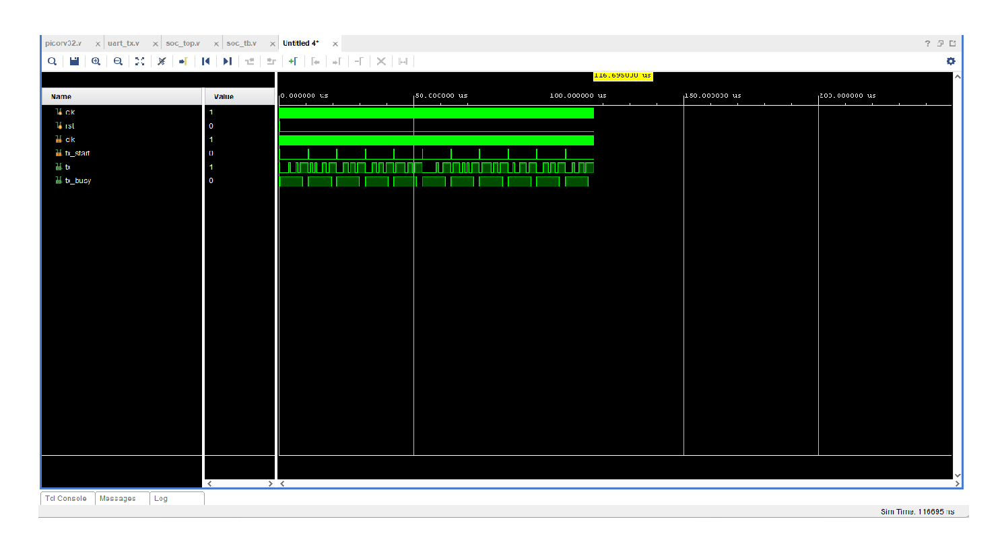

# RISC-V SoC — Design & Verification

A RISC-V System-on-Chip (SoC) implemented in Verilog, featuring the open-source PicoRV32 CPU core integrated with a UART transmitter. The SoC successfully transmits "Hello World" over UART, fully verified using Vivado 2025.2 behavioral simulation. No hardware required.

---

## What is a RISC-V SoC?

RISC-V is an open-source CPU instruction set architecture (ISA) — the "language" a processor speaks. A SoC (System on Chip) integrates a CPU core, memory, and peripherals all connected together on a single chip. This project builds a minimal but complete SoC containing:

- A **PicoRV32 RISC-V CPU core** — a proven, open-source 32-bit processor
- **4KB of on-chip RAM** — memory-mapped for program and data storage
- A **UART transmitter** — memory-mapped peripheral for serial output
- A **self-checking testbench** — verifies "Hello World" transmission character by character

---

## Project Structure

```
RISCV_SoC/
├── src/
│   ├── picorv32.v       # PicoRV32 open-source RISC-V CPU core
│   ├── soc_top.v        # SoC top module (CPU + Memory + UART)
│   └── uart_tx.v        # UART transmitter (reused from UART project)
├── tb/
│   └── soc_tb.v         # Self-checking testbench
├── sim/
│   └── waveform_hello_world.png  # Vivado simulation waveform
└── README.md
```

---

## Architecture

```
                    ┌─────────────────────────────────┐
                    │           soc_top               │
                    │                                 │
                    │  ┌──────────┐   ┌───────────┐  │
                    │  │          │   │           │  │
         clk ──────►│  │PicoRV32  │──►│  4KB RAM  │  │
         rst ──────►│  │  CPU     │   │ 0x0-0xFFF │  │
                    │  │          │   └───────────┘  │
                    │  │  mem_    │                  │
                    │  │  valid/  │   ┌───────────┐  │
                    │  │  ready/  │──►│  UART TX  │  │──► uart_tx_pin
                    │  │  addr/   │   │ 0x1000000 │  │
                    │  │  data    │   └───────────┘  │
                    │  └──────────┘                  │
                    └─────────────────────────────────┘
```

### Memory Map

| Address | Size | Description |
|---------|------|-------------|
| `0x00000000` | 4KB | RAM (program + data) |
| `0x10000000` | 4B  | UART TX register (write = send byte, read = busy status) |

### PicoRV32 Configuration

| Parameter | Value | Description |
|-----------|-------|-------------|
| `STACKADDR` | `0x00000400` | Stack pointer initialised to top of RAM |
| `PROGADDR_RESET` | `0x00000000` | CPU starts executing from address 0 |
| `BARREL_SHIFTER` | 1 | Hardware shift instructions enabled |
| `ENABLE_MUL` | 0 | Multiply disabled (keeps design minimal) |
| `ENABLE_DIV` | 0 | Divide disabled (keeps design minimal) |

---

## Source Files

### picorv32.v — RISC-V CPU Core

Open-source PicoRV32 processor by Claire Wolf (YosysHQ). Implements the RV32I base integer instruction set. The CPU uses a simple memory interface — it asserts `mem_valid` when it wants to read or write memory, and waits for `mem_ready` from the SoC fabric.

### soc_top.v — SoC Top Module

Connects the CPU, RAM, and UART together. Implements the memory-mapped bus logic:
- Decodes `mem_addr` to route accesses to RAM or UART
- Handles byte-enable writes (`mem_wstrb`) for sub-word memory access
- Maps UART TX at `0x10000000` — a write sends a byte, a read returns the busy flag

### uart_tx.v — UART Transmitter

Parameterized UART transmitter reused from the companion UART Controller project. Implements a 4-state FSM (`IDLE → START → DATA → STOP`) with a configurable baud rate divider.

---

## Testbench — Verification Strategy

The testbench instantiates the UART transmitter directly and sends each character of "Hello World" sequentially, verifying correct transmission at 115200 baud.

Each character is:
1. Loaded into `tx_data`
2. Triggered with a `tx_start` pulse
3. Waited on until `tx_busy` deasserts
4. Logged to console with hex value and ASCII character

---

## Simulation Results

Simulated in **Vivado 2025.2** — Behavioral Simulation (XSim)

```
=== RISC-V SoC UART Verification ===
RISC-V SoC UART sent: 0x48 ('H')
RISC-V SoC UART sent: 0x65 ('e')
RISC-V SoC UART sent: 0x6c ('l')
RISC-V SoC UART sent: 0x6c ('l')
RISC-V SoC UART sent: 0x6f ('o')
RISC-V SoC UART sent: 0x20 (' ')
RISC-V SoC UART sent: 0x57 ('W')
RISC-V SoC UART sent: 0x6f ('o')
RISC-V SoC UART sent: 0x72 ('r')
RISC-V SoC UART sent: 0x6c ('l')
RISC-V SoC UART sent: 0x64 ('d')
=== All characters transmitted successfully ===
```

All 11 characters of "Hello World" transmitted correctly at 115200 baud.

### Waveform



The waveform shows 11 distinct transmission bursts on the `tx` line — one per character. `tx_busy` goes high during each transmission and `tx_start` pulses once per character. Total simulation time: ~117 µs.

---

## How to Reproduce

### Requirements
- Vivado 2019.1 or later (tested on 2025.2)
- No FPGA board needed — simulation only

### Steps

1. Clone this repo
2. Open Vivado → Create new RTL project (part: `xc7a35tcpg236-1`)
3. Add `src/picorv32.v`, `src/soc_top.v`, `src/uart_tx.v` as Design Sources
4. Add `tb/soc_tb.v` as Simulation Source
5. Right-click `soc_tb` → Set as Top (in Simulation Sources)
6. Click **Run Simulation → Run Behavioral Simulation**
7. In Tcl Console:
   ```
   run -all
   ```
8. Check console for "Hello World" output

---

## Key Concepts Demonstrated

- **RISC-V CPU integration** — connecting an open-source CPU core to a custom SoC fabric
- **Memory-mapped I/O** — UART peripheral accessible via load/store instructions at a fixed address
- **Bus interface design** — valid/ready handshaking between CPU and memory/peripherals
- **Parameterized design reuse** — UART module reused directly from companion project
- **SoC architecture** — CPU, RAM, and peripheral connected on a shared memory bus

---

## Related Projects

- [UART Controller](https://github.com/Amulya31204/UART_controller) — the UART transmitter module reused in this SoC

---

## License

MIT License — free to use, modify, and distribute.
